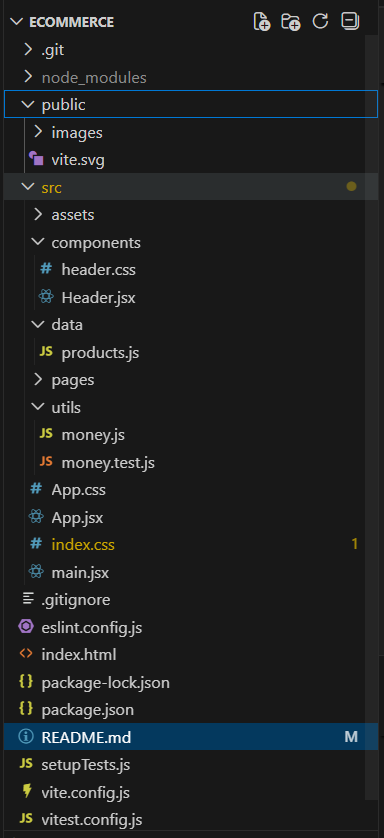
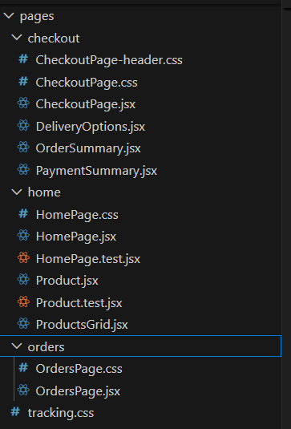
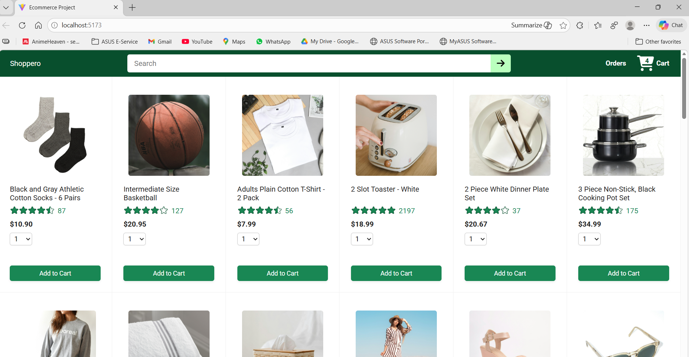
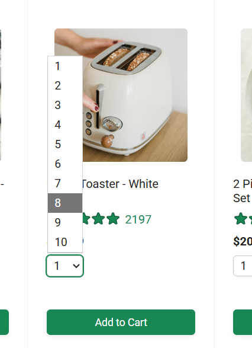
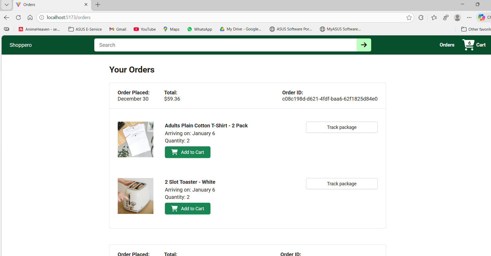
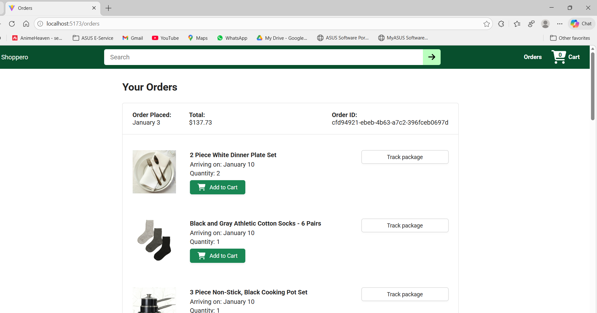

# 🛒 Ecommerce Frontend (React)

This repository contains the **frontend** of a full-stack ecommerce application built using **React**.  
It provides a complete shopping experience including product browsing, cart management, checkout, and order history.


## 🚀 Features

- Product listing with responsive grid layout
- Search products by name or keywords
- Add products to cart with quantity selection (1–10)
- Persistent cart with live cart count
- Checkout flow with:
  - Delivery option selection
  - Dynamic shipping & tax calculation
- Order placement and order history
- “Buy again” functionality
- Responsive UI inspired by real-world ecommerce platforms


## 🛠️ Tech Stack

- **React 19**
- **React Router DOM**
- **Axios**
- **CSS Grid & Flexbox**
- **Vite**
- **Vitest + React Testing Library**


## 📂 Project Structure




## ⚙️ Setup & Run Locally

### 1️⃣ Install dependencies
```bash
npm install
```
2️⃣ Start development server
```bash
npm run dev
```
The app will run on:
```bash
http://localhost:5173
```

## 🔗 Backend Dependency

This frontend consumes a REST API provided by the backend service.

Ensure the backend is running on:
```bash
http://localhost:3000
```

## 🧪 Running Tests
```bash
npm test
```

## Includes tests for:
- Product rendering
- Cart interactions
- Utility functions

## UI



